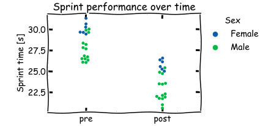

# Introductie casus <i class="fab fa-accessible-icon"></i>

In de volgende opdrachten gaan we aan de slag met een dataset afkomstig van mijn collega Nick de Vlerk. Hij staat er om
bekend dat hij vaak rommelig omgaat met zijn onderzoeksprojecten waardoor het moeilijk is om alles terug te vinden. In
de komende drie opdrachten gaan we aan de slag met de data en zorgen we dat het project weer overzichtelijk is en dat 
de data netjes en veilig is opgeslagen.

Het betreft een eenvoudige interventie studie naar het effect van een krachttrainingsprotocol op de rolstoelsprint 
prestaties. Deelnemers worden één keer voor de training gemeten (T1/pre) en één keer na de training (T2/post). Voor 
het gemak laten we even de data van de controlegroep buiten beschouwing. Bij een meting doet een proefpersoon een 
100m sprint in een sportrolstoel. De tijd, geregistreerd met een stopwatch, wordt gebruikt als uitkomst van de meting 
(lager is beter). Verder wordt het gewicht van de proefpersoon en de sekse geregistreerd. De voornaam van de proefpersoon
en het e-mail adres werden geregistreerd om contact op te nemen voor de retentiemeting (T3).

De data voor de eerste opdracht kan [hier](https://gitlab.com/Rickdkk/messy-example-project/-/raw/main/wheelchair_sprints0.zip) 
vandaan worden gedownload (.zip). Het figuur hieronder geeft een korte indruk van de data die is verzameld:

:::{figure-md} sprint-fig

Rolstoel sprint (100m) data tijdens de voor- en nameting (n=20).
:::
