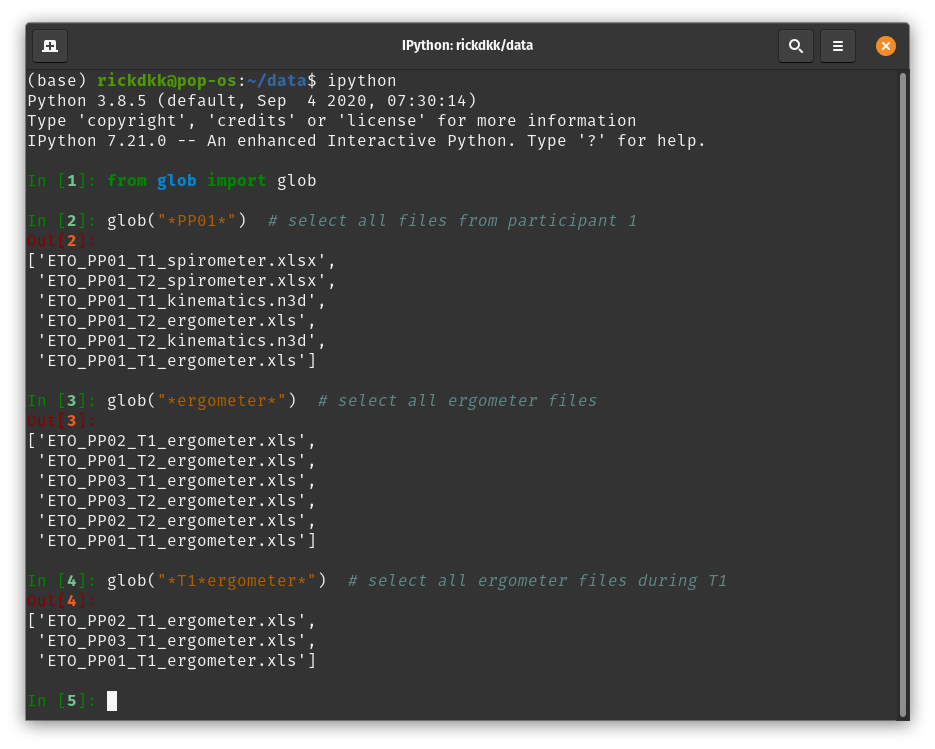
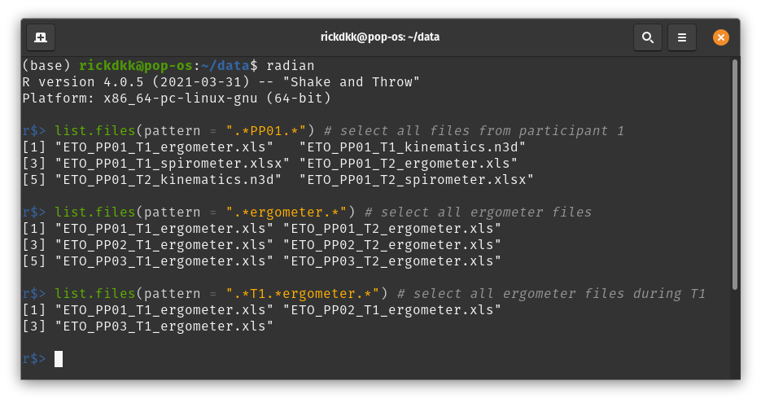
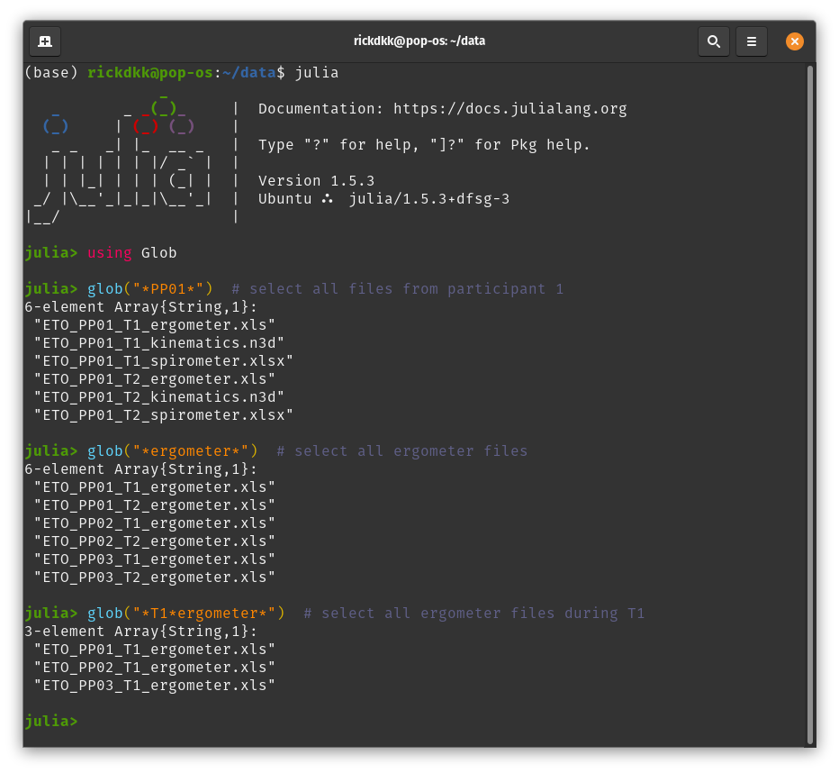
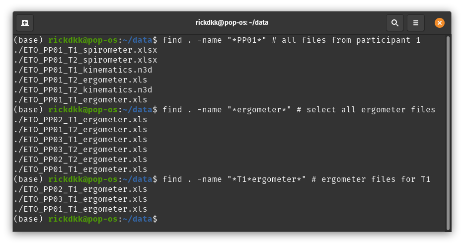
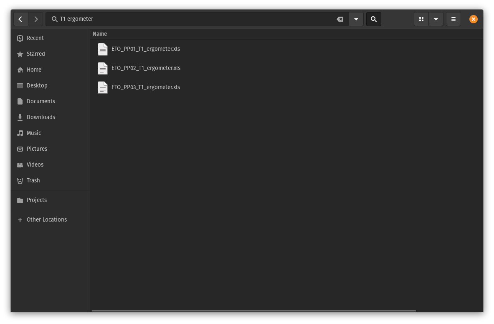

# Files organiseren

De naam van een file is belangrijk voor het identificeren van een file, maar ook voor het werken met de file. Geef 
daarom files een logische naam met waar nodig een deel van de metadata in de naam. Afhankelijk van de situatie 
(en persoonlijke voorkeur) kunnen er verschillende keuzes worden gemaakt, maar drie principes blijven leidend [^Bryan]:

1. het moet makkelijk te lezen zijn voor de computer
1. het moet makkelijk te lezen zijn voor de gebruiker
1. het moet goed te sorteren zijn

## Good practices

- **Check of er al een systeem is** bij de andere onderzoekers van de onderzoeksgroep of in de documentatie van het lab.
Als er al een systeem is dan is het vaak beter om hier gebruik van te maken. Leg het systeem vast in het DMP en de 
README.
<br><br>

- **Gebruik geen speciale karakters** zoals `~ ! @ # $ % ^ & * ( ) [ ] { } ; : " ' < > / \ | ?`. In het beste geval moet je er
omheen werken in je eigen scripts en in het slechtste geval kunnen deze botsen met het besturingssysteem of andere
software.
<br><br>
Bijvoorbeeld: Windows staat geen ASCII control karakters toe in filenamen `\/:*?"<>|`. Op Linux en OS-X kan dit wel 
(minus `/`), maar dan kan je collega de bestanden dus niet openen. Daarnaast snapt Windows het verschil tussen 
hoofdletters en kleine letters niet, let hier dus ook op.
<br><br>

::::::{margin}
:::{figure-md} iso-fig


xkcd.com over het schrijven van data
:::
::::::

- **Gebruik voor een datum altijd ISO-8601** (YYYY-MM-DD), alleen dan kan je makkelijk chronologisch sorteren. Meestal
is het handig om de datum ergens aan het eind te zetten zodat alle bestanden die bij elkaar horen ook onder elkaar staan.
<br><br>
Bijvoorbeeld: manuscript_2020-12-01.docx of manuscript_2020-12-02.docx
<br><br>
  
- **Houdt ruimte voor hogere getallen** door nullen toe te voegen aan het begin van een getal, dit wordt ook wel zero-padding
genoemd.
<br><br>
Bijvoorbeeld: BloodImage_1.xml wordt opgevolgd door BloodImage_11.xml en niet BloodImage_2.xml. Zorg er daarom voor dat 
je begint met BloodImage_01.xml en op die manier doorgaat met nummeren. Door het nummer aan het begin van een naam te 
zetten zorg je ervoor dat men altijd kan sorteren, bijv. 01_exploratory_analysis.ipynb, 02_data_cleaning.ipynb, etc.
<br><br>

- **Gebruik geen spaties**, want deze worden gebruikt om commando's te scheiden in de command-line. Gebruik een minteken 
(-), camelCase, of PascalCase om woorden te scheiden (afhankelijk van voorkeur). 
<br><br>
Bijvoorbeeld: BloodImage_2020-12-01_001.xml of blood-image_2020-12-01_001.xml
<br><br>

- **Gebruik een underscore voor verschillende elementen** van een bestandsnaam zodat men deze later kan splitsen. 
<br><br>
Bijvoorbeeld: In het bovenstaande voorbeeld is het erg makkelijk om de naam, datum, en metingnummer uit de bestandsnaam 
te halen door de naam te splitsen op de underscore. De volgorde van de elementen bepaalt hoe de bestanden standaard 
gesorteerd worden. Verderop volgt een uitgebreider voorbeeld.
<br><br>  

- **Beschrijf de inhoud van een bestand** en geef het niet alleen een getal. Een file zoals figuur_3.png zorgt meteen 
voor verwarring wanneer er een figuur wordt toegevoegd of verwijderd in het manuscript en zonder te kijken weet je niet
welk figuur het betreft. Beschrijf daarom ook altijd de inhoud van een file met de naam.
<br><br>
Bijvoorbeeld: beurskoers_gme.png of BloodImage_001.png
<br><br>

- **Gebruik versienummers** of — nog beter — een versiebeheersysteem. Spreek van tevoren af wat de strategie is voor
versiebeheer zodat je niet uitkomt op een manuscript_v2_FINAL_FINAL.docx. Men kan bijvoorbeeld [semantic versioning](https://semver.org/)
gebruiken. 
  
### Mini-quiz

`````{panels}
Welke van deze voorbeelden is geschikt:
^^^
```{dropdown} Abstract for ISB 2020-08-16.docx
:title: + p-2
:body: + p-2 bg-warning
**Fout:** de filenaam bevat spaties, dat kan het automatiseren van analyses verhinderen.
```
```{dropdown} abstract-for-isb_2021-08-16.docx
:title: + p-2
:body: + p-2 bg-success
**Correct:** de datum is in YYYY-MM-DD, het is duidelijk wat de inhoud van de file is, en de naam 
bevat geen speciale karakters.
```
```{dropdown} abstract-for-isb_16-08-2021.docx
:title: + p-2
:body: + p-2 bg-warning
**Fout:** de datum is niet op een sorteerbare volgorde gegeven, gebruik altijd YYYY-MM-DD.
```
---
Welke van deze voorbeelden is geschikt:
^^^
```{dropdown} fig01_regplot-speed-vs-power.png
:title: + p-2
:body: + p-2 bg-warning
**Fout-ish:** er is zero-padding toegepast en het is direct duidelijk om welk figuur het gaat, maar kán onduidelijk zijn 
wanneer het figuurnummer in het manuscript veranderd.
```
```{dropdown} fig_regplot-speed-vs-power.png
:title: + p-2
:body: + p-2 bg-success
**Correct:** het is direct duidelijk om welk figuur het gaat en door te beginnen met fig staan alle figuren onder elkaar
in de map wanneer gesorteerd wordt (niet noodzakelijk).
```
```{dropdown} figure_01_2020-08-16.png
:title: + p-2
:body: + p-2 bg-warning
**Fout:** er is een versienummer toegevoegd op basis van de datum, maar het is niet duidelijk wat de inhoud van de file is.
```
``````

## Een systeem: voorbeeld

Hieronder volgt een voorbeeld uit onderzoek naar rolstoelpropulsie dat vergelijkbaar is met de casus. Aan het begin van 
het project was duidelijk dat het zou gaan om ongeveer 1000 files, dus er was een strategie voor het benoemen van files 
afgesproken, zodat de studenten die hielpen met de dataverzameling direct alles in het juiste format konden opslaan. Er 
werd gekozen voor een strategie die de 'nesting' van de data reflecteerde: er zijn meerdere proefpersonen, die worden 
meerdere keren gemeten, met meerdere meetinstrumenten. De bestandsnaam kreeg dus de volgende hiërarchische opbouw:

\<**experiment**\>\_\<**proefpersoon_id**\>\_\<**meting**\>\_\<**meetinstrument**\>.\<**extensie**\>

Bijvoorbeeld: `WL_PP01_T01_ergometer.ods`, ofwel de ergometerdata van het 'WL' experiment van proefpersoon 01 op tijd 01.
Hiermee is alle metadata van een bestand direct beschikbaar in de filenaam en zijn de namen 'machine readable', daardoor 
kunnen we door gemakkelijk data selecteren (door te 'globben'). Met deze structuur kunnen we na de data verzameling, 
bijvoorbeeld, alle data van proefpersoon 1, alle ergometer data, of alle ergometer data van T01 selecteren:

```{tabbed} Python

```

```{tabbed} R

```

```{tabbed} Julia

```

```{tabbed} Shell

```

```{tabbed} Explorer

```

Het is hierbij dus erg belangrijk dat de bestandsnamen consistent en voorspelbaar zijn. Een typo kan ertoe leiden dat
er bestanden worden overgeslagen. Leg dus ook goed vast wat de conventie is m.b.t. het zero-padden van nummers en het 
gebruik van hoofdletters. De voordelen zijn echter gigantisch: het handmatig selecteren van 100 of 200 files is onbegonnen
werk. Door dit process te automatiseren kunnen we veel tijd besparen. Als dan later blijkt dat er toch een nét een iets 
andere selectie nodig was is dat ook geen probleem.

---

:::{eval-rst}
.. link-button:: ../assignments/0_casus
    :type: ref
    :text: Klaar voor een opdracht!
    :classes: btn-outline-primary btn-block
:::

[^Bryan]: Bryan J. Naming things. 2015 May 04. Retrieved from: https://speakerdeck.com/jennybc/how-to-name-files
