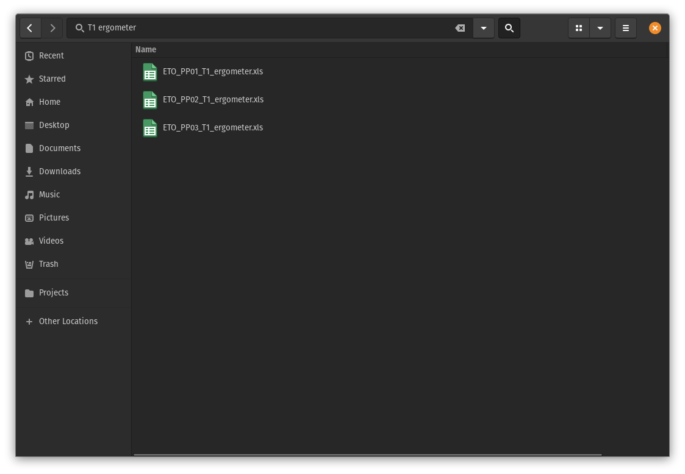

# Files organiseren

De naam van een file is belangrijk voor het identificeren van een file, maar ook voor het werken met de file. Geef 
daarom files een logische naam met waar nodig een deel van de metadata in de naam. Afhankelijk van de situatie 
(en persoonlijke voorkeur) kunnen er verschillende keuzes worden gemaakt, maar drie principes blijven leidend:

1. het moet makkelijk te lezen zijn voor de computer
1. het moet makkelijk te lezen zijn voor de gebruiker
1. het moet goed te sorteren zijn

## Good practices

- **Gebruik geen speciale karakters** zoals `~ ! @ # $ % ^ & * ( ) [ ] { } ; : " ' < > / \ | ?`. In het beste geval moet je er
omheen werken in je eigen scripts en in het slechtste geval kunnen deze botsen met het besturingssysteem of andere
software.
<br><br>
Bijvoorbeeld: Windows staat geen ASCII control karakters toe in filenamen `\/:*?"<>|`. Op Linux en OS-X kan dit wel, 
maar dan kan je collega de bestanden dus niet openen.
<br><br>
  
::::::{margin}
:::{figure-md} iso-fig


xkcd.com over het schrijven van data
:::
::::::

- **Gebruik voor een datum altijd ISO-8601** (YYYY-MM-DD), alleen dan kan je makkelijk chronologisch sorteren. 
<br><br>
Bijvoorbeeld: manuscript_2020-12-01.docx of manuscript_2020-12-02.docx
<br><br>
- **Houdt ruimte voor hogere getallen** door nullen toe te voegen aan het begin van een getal, dit wordt ook wel zero-padding
genoemd.
<br><br>
Bijvoorbeeld: BloodImage_1.xml wordt opgevolgd door BloodImage_11.xml en niet BloodImage_2.xml. Zorg er daarom voor dat 
je begint met BloodImage_01.xml en op die manier doorgaat met nummeren. 
<br><br>
- **Gebruik geen spaties**, want deze worden gebruikt om commando's te scheiden in de command-line. Gebruik een `-` of 
PascalCase om woorden te scheiden (afhankelijk van voorkeur). 
<br><br>
Bijvoorbeeld: 2020-12-01_BloodImage_001.xml of 2020-12-01_blood-image_001.xml
<br><br>
- **Gebruik een underscore voor verschillende elementen** van een bestandsnaam. 
<br><br>
Bijvoorbeeld: In het bovenstaande voorbeeld is het erg makkelijk om de datum, naam, en metingnummer uit de bestandsnaam 
te halen door de naam te splitsen op de underscore. De volgorde van de elementen bepaalt hoe de bestanden standaard 
gesorteerd worden.
<br><br>  
- **Beschrijf de inhoud van een bestand** en geef het niet alleen een getal. Een file zoals figuur_3.png zorgt meteen 
voor verwarring wanneer er een figuur wordt toegevoegd of verwijderd in het manuscript. Beschrijf daarom ook altijd de 
inhoud van een file met de naam.
<br><br>
Bijvoorbeeld: beurskoers_gme.png of BloodImage_001.png

## Voorbeeld

Hieronder volgt een voorbeeld uit mijn eigen onderzoek. Aan het begin van het project is een strategie voor het benoemen
van files afgesproken. Er is gekozen voor een strategie die de 'nesting' van de data reflecteerde: er zijn meerdere 
proefpersonen, die worden meerdere keren gemeten, met meerdere meetinstrumenten. De bestandsnaam kreeg dus de volgende 
opbouw:

\<**experiment**\>\_\<**proefpersoon**\>\_\<**meting**\>\_\<**meetinstrument**\>.\<**extensie**\>

Door ervoor te zorgen dat de data ‘machine readable’ is kunnen we met regular expressions of door te ‘globben’ 
gemakkelijk data selecteren. Hieronder een voorbeeld van een aantal files met de volgende naamsopbouw:


```{tabbed} Python

```

```{tabbed} R

```

```{tabbed} Julia

```

```{tabbed} Shell

```

```{tabbed} Explorer

```

Door deze structuur te hanteren kunnen we achteraf, bijvoorbeeld, alle data van proefpersoon 1, alle ergometer data, of alle ergometer data van T1 selecteren:
