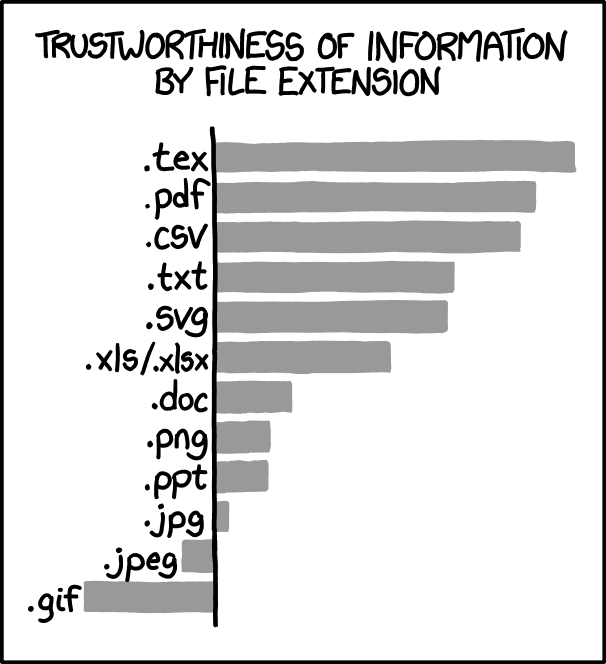

# Good practices

Er zijn veel verschillende soorten data en iedereen werkt met verschillende analysetools. Toch zijn er een aantal 
praktische aanbevelingen die we kunnen doen om data zo te organiseren dat het geschikt is voor analyse en archivering.

::::::{margin}
:::{figure-md} extensions-fig

xkcd.com over file extensies
:::
::::::

- **Gebruik open formats** voor de opslag van data. Dit werd al kort behandeld bij {doc}`./1_good_practices`.
  
- **Gebruik .csv in plaats van .xlsx** of in ieder geval .ods voor spreadsheet data. In praktijk wordt (te) veel data in
spreadsheets bewaard. Door gebruik te maken van .csv bestanden kunnen we ervoor zorgen dat de data makkelijk te verwerken
is met andere tools en dat het bestand niet beschadigd raakt.
  
- **Werk in een kopie van de data** en pas nooit de ruwe data aan. Hou transformaties bij in een los document, een script,
of door bijv. de SPSS syntax op te slaan.
  
- **Gebruik geen spreadsheet programma** voor analyses of plotten. Het voornaamste probleem is dat het moeilijk is om 
te zien wat de flow van data is in een spreadsheet. Er zijn gespecialiseerde programma's die dit werk op een 
reproduceerbaardere manier kunnen doen. 
  
- **Gebruik consistente waarden** door bijvoorbeeld een [data dictionary](https://help.osf.io/hc/en-us/articles/360019739054-How-to-Make-a-Data-Dictionary)
te gebruiken en/of door data validatie toe te passen op de data.
  
- **Let op missings** en leg een systeem vast om met missing data om te gaan. Vroeger gebruikte men daarvoor vaak de 
waarde 999, maar tegenwoordig kan de meeste software gewoon omgaan met missings. Gebruik je toch speciale waarden? Leg
dit dan vast en zorg dat iedereen hiervan op de hoogte is.
  
- **Gebruik versie nummers** of version control (bijv. Git LFS of DVC). Hou versies bij als de data wordt aangevuld of 
aangepast en spreek met je collega's af welke versiestrategie je gebruikt.
  
- **Gebruik descriptieve headers** en/of variabele namen. Probeer ervoor te zorgen dat mensen zo min mogelijk hoeven te
zoeken wat een variabele betekent. Met descriptieve headers is de data al voor een heel deel zelf-documenterend.
  
- **Gebruik een tidy format**: {doc}`2_tidy_data`
