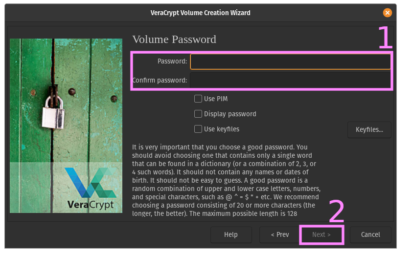

# Pseudonimiseren

Bij pseudonimiseren worden herleidbare data vervangen door een pseudoniem (ook wel token) die wordt opgeslagen in een 
sleutelbestand. Door het sleutelbestand te gebruiken kan je de data weer reconstrueren. 
Pseudonimiseren kan bijvoorbeeld handig zijn als de naam van de proefpersoon nogmaals gebruikt moet worden
om contact op te nemen voor een vervolgmeting of om resultaten te delen (bijv. in medisch onderzoek). Men kan de 
naam/adresgegevens niet naast de rest van de data bewaren, maar deze kan men wel bewaren in een sleutelbestand die
op een andere plek staat opgeslagen en goed is beveiligd. Pseudonimiseren beschermd de identiteit van de participanten
zolang de data goed genoeg is gepseudonimiseerd, het niet mogelijk is om de data tussen datasets te linken, en het 
pseudoniem niet teruggedraaid kan worden. Zolang de sleutel nog bestaat is de data dus niet anoniem.
En als de sleutel is verwijderd kan het zijn dat er nog aanvullende stappen nodig zijn voordat de data echt anoniem is.

:::{caution}
Gepseudonimiseerde data is nog steeds persoonlijke data en moet als zodanig behandeld worden. Pas als het onmogelijk is
om de participant te herleiden spreken we van anonieme data. 
:::

## Sleutelbestand

In het sleutelbestaand staan de persoonsgegevens die beschermd moeten worden naast de tokens die zijn toegeschreven aan
de andere data. Met het sleutelbestand kan men de data weer reconstrueren. Het is daarom belangrijk dat het 
sleutelbestand op een aparte en veilige plaats staat opgeslagen. [Opdracht 3](../assignments/3_data_minimalisatie_opdracht.md)
gaat in op het versleutelen van data. In 2019 heeft LCRDM [^LCRDM] een stappenplan opgesteld om data te pseudonimiseren,
hier volgt een korte samenvatting:

1. Bedenk van tevoren welke data je wilt pseudonimiseren en hoe je dat gaat doen. Leg dit vast in je DMP.
1. Verwijder data die je niet nodig hebt meteen. Vervang data die voor identificatie nodig zijn met een pseudoniem.
1. Gebruik verschillende pseudoniemen voor verschillende datasets zodat data niet gekoppeld kan worden.
1. Bewaar het sleutelbestand op een veilige plek, los van de onderzoeksgegevens.
1. Zorg voor een back-up en goede beveiliging van zowel de data als het sleutelbestand.
1. Beperk de toegang tot het sleutelbestand, maar zorg er wel voor dat er altijd nog iemand is die ook toegang heeft
tot het bestand.

Een aantal punten om op te letten zijn:

- Stuur het sleutelbestand niet mee met de data als je deze deelt.
- Zorg dat het sleutelbestand niet afhankelijk is van de kennis van één persoon.'
- Bewaar het wachtwoord goed: geen wachtwoord is geen data.

:::{figure-md} security-fig


xkcd.com over data security
:::

## Tokenizen

::::::{margin}
:::{note}
Bij grootschalig onderzoek wordt het pseudonimiseren en sleutelbeheer soms uitbesteed aan een
Trusted Third Party. Bij kleinschalig onderzoek komt dit echter vrijwel nooit voor.
:::
::::::

Het pseudonimiseren van data kan redelijk eenvoudig zijn tot erg moeilijk afhankelijk van de context van het onderzoek.
Zo is het opslaan van een e-mail adres en het koppelen daarvan aan een identifier vrij gemakkelijk. Het meest toegankelijke
voorbeeld is door gebruik te maken van een counter (PP01, PP02, PP03, etc.). Dit zou men in een
spreadsheet kunnen opslaan met bijvoorbeeld een willekeurig getal van www.random.org. Met de random module van de
programmeertaal die jouw voorkeur heeft. Of in een spreadsheet programma.

Het is ook mogelijk om data te tokenizen door een hash algoritme te gebruiken met een pepper. Het voordeel hiervan is 
dat men op die manier automatisch nieuwe data van dezelfde persoon kan pseudonimiseren met hetzelfde pseudoniem. Men
kan ook een pepper en een salt gebruiken voor extra beveiliging. De implementatie hiervan is echter lastig en brengt
daardoor risico's met zich mee.

In kwalitatief onderzoek kan men namen vervangen door vierkante haakjes te gebruiken met een omschrijving: 
`[persoon/buurman/moeder/docent]`. Of men kan bijvoorbeeld de text annoteren met XML-tags. Het wordt echter lastiger
als, bijvoorbeeld, een naam ook context geeft doordat het iets zegt over de culturele achtergrond van een persoon en
dit relevant kan zijn voor het onderzoek. Hierbij moet men wel weer oppassen voor eventuele vooroordelen die in de data
terecht zouden kunnen komen. In zo'n geval is er dus een uitgebreide aanpak nodig om de data te pseudonimiseren die men 
dus goed moet documenteren. 

## Versleutelen

Het versleutelen van onderzoeksdata kan belangrijk zijn bij het pseudonimiseren van data of als data op een mobiele 
gegevensdrager verplaatst moet worden. Hieronder lees je hoe je jouw data gemakkelijk kan versleutelen met de 
populaire encryptietool VeraCrypt.

In grote lijnen moeten de volgende dingen gebeuren:
- VeraCrypt installeren
- Een versleutelde file aanmaken
- De versleutelde file openen


Hieronder vind je in dertien stappen een werkwijze om versleutelde files aan te maken. Schrik niet: stap 0-10 hoeft maar 
één keer worden gedaan om een versleuteld bestand aan te maken, daarna kan je heel snel het bestand weer openen met
VeraCrypt (zolang je over het wachtwoord beschikt).

```{tabbed} Stap 0


Allereerst moet je VeraCrypt [downloaden](https://veracrypt.fr/en/Downloads.html), dat kan op hun site. Onder het kopje
downloads vind je verschillende installers voor Windows, macOS, en Linux. Bij Windows kun je kiezen uit een installer 
om hem op je pc te zetten of de portable versie. Deze versie hoef je niet te installeren en zou je bijvoorbeeld op een 
USB-stick kunnen zetten om zo op iedere Windows pc te kunnen runnen: wel zo handig als je data van pc's in het lab wil
halen en meteen wil versleutelen. 
```

```{tabbed} Stap 1


Als je het programma hebt geïnstalleerd moet je hem nu opstarten. De interface zal er ongeveer zo uit zien als in 
het onderstaande plaatje. Nu moet er eerst een versleutelde file worden aangemaakt.

**>>> Klik op het knopje "Create Volume".**
```

```{tabbed} Stap 2


In dit voorbeeld maken we een versleutelde file aan, dat is de eerste optie.

**>>> Klik op "Next >".**
```

```{tabbed} Stap 3


Hier kan je kiezen uit een standaard volume of een hidden volume. We gaan er voor het gemak even van uit dat je niet 
gemarteld zal worden om je wachtwoord vrij te geven, daarom gaan we verder met de voorgeselecteerde optie, het Standard
VeraCrypt volume.

**>>> Klik op "Next >".**
```

```{tabbed} Stap 4 


Nu moeten we kiezen waar je de file wilt opslaan. Dat kan op je eigen computer zijn of bijvoorbeeld op een USB-stick.

**>>> Klik op "Select File..." en kies een locatie om de file op te slaan en een naam voor het bestand.**<br>
**>>> Klik op "Next >".**
```

```{tabbed} Stap 5


Nu moet er gekozen worden voor een encryptie algoritme. Alle algoritmes in VeraCrypt zijn bewezen veilig, maar er zit
wel wat verschil tussen de opties. De standaardoptie AES met een SHA-512 Hash is meer dan voldoende voor de meeste 
toepassingen en werkt ook heel vlot.

**>>> Klik op "Next >".**
```

```{tabbed} Stap 6


Nu moet er gekozen worden voor de grootte van het bestand. Dit bepaald hoe veel data je straks versleuteld kan opslaan.
Om te voorkomen dat er later data overgezet moet worden kan je het beter iets te veel kiezen dan net genoeg.

**>>> Kies de hoeveelheid data die jij wilt gebruiken. In het voorbeeld gebruiken we 100 MiB (≈105MB).**<br>
**>>> Klik op "Next >"**
```

```{tabbed} Stap 7


Nu moet er een wachtwoord gekozen worden die later nodig is om de file te kunnen decrypten. Volg hierbij de instructies
in dit menu. Een wachtwoord dat te makkelijk of te kort is heeft vrij weinig nut.

**>>> Kies een wachtwoord.**<br>
**>>> Klik op "Next >".**
```

```{tabbed} Stap 8


Nu moet het filesysteem gekozen worden. FAT is een oud format maar wel breed ondersteund. Hier kan dus wederom de
standaardoptie gekozen worden. Wil je bestanden groter dan 4GB opslaan, kies dan voor een ander format.

**>>> Kies een ander filesysteem als dat de voorkeur heeft.**<br>
**>>> Klik op "Next >".**
```

```{tabbed} Stap 9


Nu wordt de file geformatteerd. Om ervoor te zorgen dat de file goed versleuteld wordt moet je zelf nog wat 
willekeurigheid toevoegen door met je muis over het scherm te bewegen.

**>>> Beweeg met je muis over het scherm.**<br>
**>>> Klik op "Format".**
```

```{tabbed} Stap 10


Het volume is nu aangemaakt. Je kan ervoor kiezen om nog een volume te maken of om af te sluiten.

**Klik op "Exit".**
```

```{tabbed} Stap 11


In je file explorer moet je nu het versleutelde bestand kunnen vinden. Als je deze zou openen met een applicatie dan zie
je allemaal onzin, dat komt omdat het bestand nog versleuteld is. De voorgaande stappen zijn dus éénmalig om het 
bestand aan te maken. Om het bestand te nu openen is VeraCrypt wederom nodig.

**>>> Selecteer het bestand wat je zojuist hebt versleuteld (de locatie en naam heb je gekozen in stap 4).**<br>
**>>> Klik op "Mount".**<br>
**>>> Vul het wachtwoord uit stap 7 in.**
```

```{tabbed} Stap 12


In je file explorer moet er nu een nieuwe map staan. Op Windows is dit bijvoorbeeld de A: schijf, op mac of Linux 
is dit bijvoorbeeld slot 1. Door te dubbelklikken op de regel in VeraCrypt opent file explorer de map. Deze map werkt 
zoals een gewone map op de computer. Je kan bestanden aanmaken en verplaatsen. Als je klaar bent klik je op "Dismount" 
en dan kan niemand meer bij je vertrouwelijke onderzoeksdata. 
```

## Tot slot

Zorg dat je het wachtwoord goed bewaard en dat een collega ook toegang heeft tot het wachtwoord. Zo voorkom je eventuele
problemen. Daarnaast is het versleutelen van bestanden geen uitweg voor slecht Research Data Management. Zorg dus altijd
voor een goed Data Management Plan en gebruik deze ook. Succes!

[^LCRDM]: Omgang met pseudonimisering en sleutelbestanden bij kleinschalig onderzoek. 2019. DOI: 10.581/zenodo.3571046. https://www.lcrdm.nl/files/lcrdm/2019-12/LCRDM%20Pseudonimisering%20en%20sleutelbestanden_NL_online.pdf 